# Pumex library

The purpose of the **Pumex** library is to create an efficient and universal rendering engine using **Vulkan API** that has following properties :

- enables **multithreaded rendering on many windows** ( or many screens ) at once, may use many graphics cards in a single application
- uses **render graph** for rendering
- decouples rendering stage from update stage and enables **update step with constant time rate** independent from rendering time rate
- uses modern C++ ( C++11 to C++17 ) but not overuses its features if it's not necessary
- works on many platforms ( at the moment Pumex supports rendering inside native windows on  **Windows** and **Linux** operating systems and optionally - inside **QT** windows. **Android port is planned** ).
- implements efficient rendering algorithms ( like instanced rendering with vkCmdDrawIndexedIndirect() to draw many objects of different types with one draw call )

Quick preview on Youtube :

[](https://youtu.be/3lyGE-0T3jY "Pumex preview on Youtube")


You can follow library development [on Twitter](https://twitter.com/pumex_lib) .

---


## Library architecture

*This paragraph assumes that reader knows Vulkan specification.*

Every Pumex application consists of three distinct layers of objects :

- first layer is responsible for creation and configuration of Vulkan instance, logical devices, surfaces and windows. Let's call it a **device layer**. Below you may see an example of such layer.


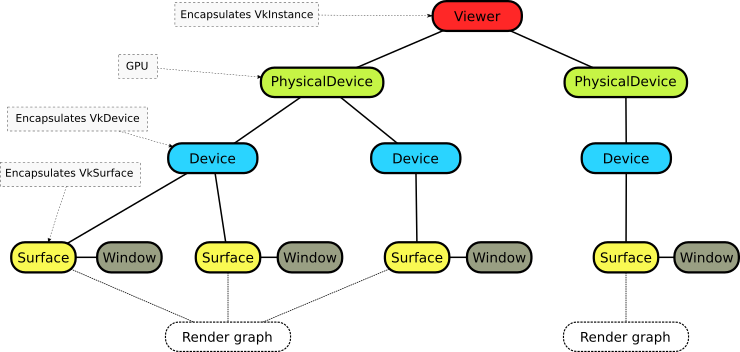

​

- second layer is called a **render graph**  ( also known in literature as frame graph ). Each Vulkan surface rendered by the application may use **one or more** render graphs. Render graphs may be shared between surfaces ( see: image above ).

  Render graph defines render operations and inputs/outputs between them. During application run  abstract render graph is compiled into a set of Vulkan objects required to render a scene: graphics passes and subpasses ( with its attachments and dependencies ), compute passes, images, buffers, attachments and pipeline barriers.  These objects are then used to build a primary command buffers.

  Each render graph may use one or more Vulkan queues for its execution.

  An example of render graph for a simple deferred renderer with depth prepass is shown below.


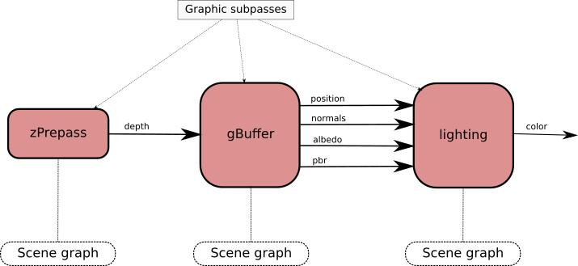


- third layer is called a **scene graph**. Every render operation ( graphics subpass from image above ) has its own scene graph. All nodes in a scene graph derive from **pumex::Node** class and can be categorized as follows :
  - pipelines defining render state such as used shaders, culling, blending, depth test state, etc ( **pumex::GraphicsPipeline**, **pumex::ComputePipeline** )
  - nodes that store vertex and index data ( pumex::AssetBufferNode, pumex::AssetNode, pumex::DrawVerticesNode )
  - nodes that perform *vkCmdDraw* calls ( **pumex::AssetBufferDrawNode**, **pumex::AssetBufferDrawIndirectObject**, **pumex::AssetNode**, **pumex::DrawVerticesNode**, **pumex::Text** ) - these nodes are leafs in a scene graph
  - node that performs vkCmdDispatch in compute operations ( **pumex::DispatchNode** )
  - helper nodes ( **pumex::Group**, **pumex::AssetBufferFilterNode** )

Each node may have *descriptor sets* connected to it. Descriptor sets consist of images and buffers along with their GPU representation ( whether they should be treated as uniform buffers, storage buffers, sampled images, samplers, etc.).

By default the scene graph is included into primary command buffer building, but subgraphs may be moved to secondary buffers ( as long as secondary buffers include graphics pipeline / compute pipeline - this is Vulkan requirement ). Secondary command buffers may be built/rebuilt in parallel to each other.

Scene graph shown below is connected to the *"lighting"* operation from image above. First graphics pipeline to the left defines shaders that use gbuffers as input attachments. As a result, pumex::AssetNode draws a fullscreen triangle that uses gbuffers to render lighting. Second and third graphics pipelines render statistics GUI: pumex::DrawVerticesNode draws rectangles representing CPU timing of different rendering stages. pumex::Text nodes render FPS counter and names of rendering stages.

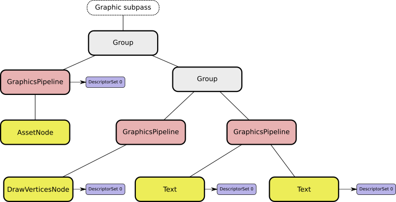


## Articles discussing various features of the library

#### [Basic tutorial : rendering single 3D object](doc/tutorial.md)

#### [How does main render loop work](doc/render_loop.md)

#### [Multithreaded cooperation between render stage and update stage](doc/update_render_coop.md)

#### [Memory buffers and images in detail](doc/buffers_images.md)

#### [Asset class and its components](doc/asset.md)


## Pumex examples

Pumex library comes with a set of examples implementing different aspects of it. Each of the examples accepts following options from command line :

```
-h, --help                        display this help menu
-d                                enable Vulkan debugging
-f                                create fullscreen window
-p [presentation_mode]            presentation mode (immediate, mailbox, fifo, fifo_relaxed)
-u [update_frequency]             number of update calls per second
```
Default value for presentation mode is **mailbox** ( = VK_PRESENT_MODE_MAILBOX_KHR ).

While each example is running , you are able to use following inputs :

- **W**, **S**, **A**, **D**, **Q**, **Z** - move camera : forward, backward, left, right, up, down

- **Left Shift** - move camera faster

- **LMB** - rotate camera around origin point

- **RMB** - change distance to origin point

- **F4** - change application statistics mode. Available modes are : **"no statistics"**, **"FPS counter"**, **"CPU stats"**

- **F5**, **F6** - change time scale in "CPU stats" mode

- **F7**, **F8** - show less / more frames in "CPU stats" mode


### pumexcrowd

Application that renders a crowd of 500 animated people on one or more windows.

Application presents :

- how to utilize **compute operation** in a render worklow.
- how to use output storage buffer from compute operation as input indirect buffer in a following render operation

- how to use instanced rendering nodes like **pumex::AssetBufferFilterNode** and **pumex::AssetBuffer**
- how to store textures in texture array and use texture array during instanced rendering

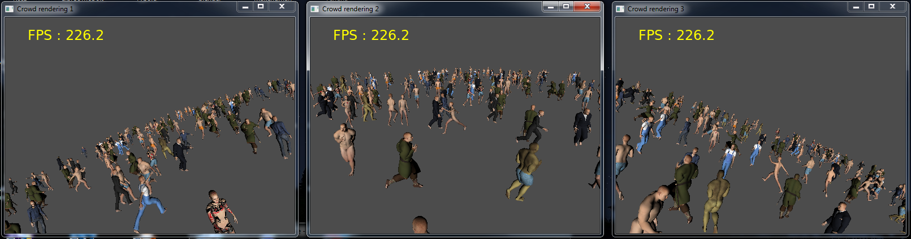

- There are 3 different models of human body, each one has 3 LODs ( levels of detail ) :
  - LOD0 has 26756 triangles
  - LOD1 has 3140 triangles
  - LOD2 has 1460 triangles
- Skeleton of each model has 53 bones
- Each body has 3 texture variants
- Each model has 3 different sets of clothes ( also 3D models ). Each cloth has only 1 LOD.
- Each model randomly chooses one of four provided animations.

Apart from standard command line parameters **pumexcrowd** example uses also following ones :

```
      -v                                create two halfscreen windows for VR
      -t                                render in three windows
```

Below is additional image showing pumexcrowd example working in VR mode ( 2 windows - each one covers half of the screen, window decorations disabled ) :

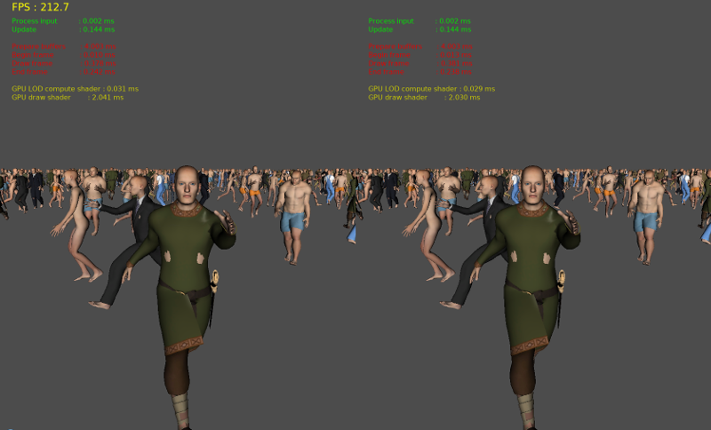


### pumexgpucull

 Application that renders simple not textured static objects ( trees, buildings ) and dynamic objects ( cars, airplanes, blimps ) on one or more windows.

This application serves as performance test, because all main parameters may be modified ( LOD ranges, number of objects, triangle count on each mesh ). All meshes are generated procedurally. Each LOD for each mesh has different color, so you may see, when switches betwen LODs occur.

In OpeneSceneGraph library there is almost the same application called osggpucull, so you may compare performance of Vulkan API and OpenGL API.

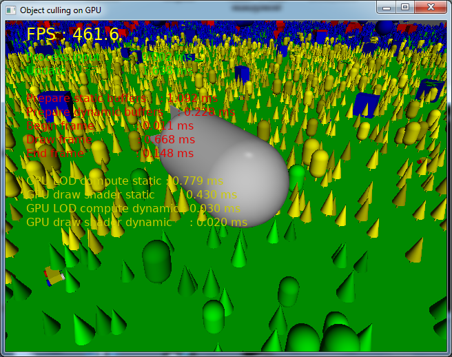

Command line parameters enable us to use one of predefined window configurations and also we are able to modify all parameters that affect performance:

```
  -v                                create two halfscreen windows for VR
  -t                                render in three windows
  --skip-static                     skip rendering of static objects
  --skip-dynamic                    skip rendering of dynamic objects
  --static-area-size=[static-area-size]
                                    size of the area for static rendering
  --dynamic-area-size=[dynamic-area-size]
                                    size of the area for dynamic rendering
  --lod-modifier=[lod-modifier]     LOD range [%]
  --density-modifier=[density-modifier]
                                    instance density [%]
  --triangle-modifier=[triangle-modifier]
                                    instance triangle quantity [%]
  --instances-per-cell=[instances-per-cell]
                                    how many static instances per cell
```


### pumexdeferred

Application that makes deferred rendering with multisampling in one window. The number of samples per pixel may be configured from command line ( see parameters below ). Available values of samples per pixel include : 1, 2, 4, 8.

By default application uses depth prepass rendering, but you are able to switch it off using command line parameters ( see below ).

Application presents how to use attachment produced by one render operation as input attachment in a following render operation.

Famous Sponza Palace model is used as a render scene.

Shaders used in that example realize **physically based rendering** inspired by [learnopengl.com](https://learnopengl.com/#!PBR/Theory)

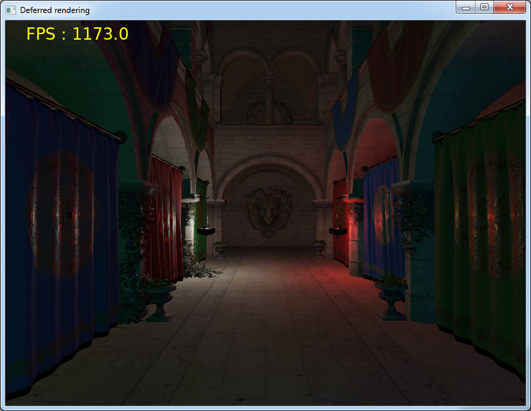

Additional command line parameters :

```
    -n                                skip depth prepass
    -s[samples]                       samples per pixel (1,2,4,8). Default = 4
```


### pumexmultiview

Application based on pumexdeferred example. It shows how to utilize **VK_KHR_multiview** extension to render two images at the same time ( without a need for a second render graph and scene graph traversal ) and how to apply barrel distortion.

Shaders used in that example realize **physically based rendering** inspired by [learnopengl.com](https://learnopengl.com/#!PBR/Theory)

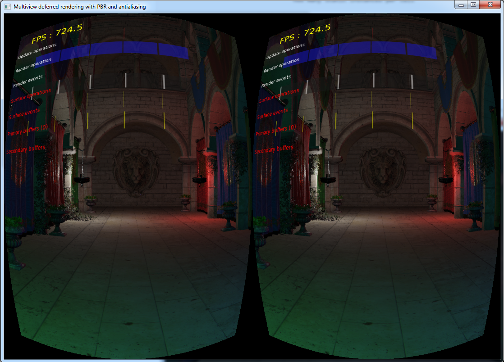


### pumexviewer

Minimal pumex application that renders single non-textured 3D model **provided by the user in command line** along with its bounding box. You may render any model as long as Assimp library is able to load it and sum of model's vertex and index size is less than 64 MB.

Application presents simplest possible render worklow with only one render operation.

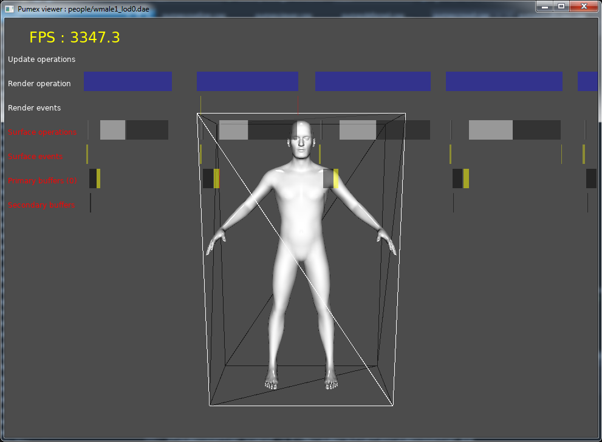

Additional command line parameters :

```
  model                             3D model filename
  animation                         3D model with animation
```

Examples of use ( command line ) :

Show animated model of a man ( running animation ) :

```
pumexviewer people/wmale1_lod0.dae people/wmale1_run.dae
```

Show Sponza palace model :

```
pumexviewer sponza/sponza.dae
```


### pumexviewerqt

If Pumex was built withQT support enabled ( CMake flag **PUMEX_BUILD_QT** set to ON - see: **Building and installation** section ), then there is additional example showing how to create a window using **QT** library and how to cooperate with it. **pumexviewerqt** example performs rendering the same way as **pumexviewer** example. 

Difference is that models and animations are not loaded from command line, but when user presses appropriate buttons to do so ( code presents how to use QFileDialog to load a 3D model and send data to pumex application using QT signals ). Additionally user may change model color ( code shows how to use QColorDialog ).

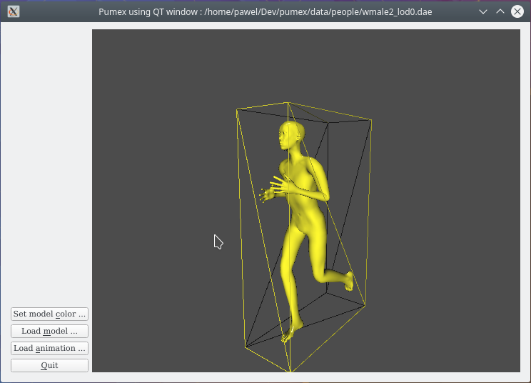


### pumexvoxelizer

Application that performs realtime voxelization of a 3D model **provided by the user in command line**. After producing 3D texture raymarching algorithm is used to render it on screen.

Application presents

-  how to use output image from one render operation as input image in a following render operation
- how to perform **conservative rendering** to 3D texture without conservative rendering extension present

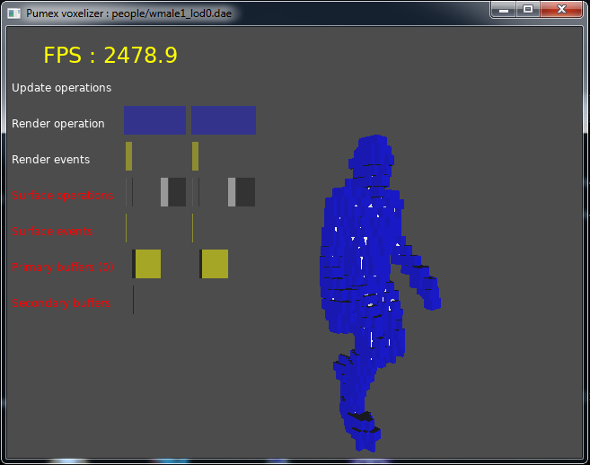

Additional command line parameters :

```
  model                             3D model filename
  animation                         3D model with animation
```

Examples of use ( command line ) :

Voxelize and render animated model of a man ( running animation ) :

```
pumexvoxelizer people/wmale1_lod0.dae people/wmale1_run.dae
```

Voxelize and render Sponza palace model :

```
pumexvoxelizer sponza/sponza.dae
```

------


## Windows installer

##### If you want to see examples in action - there's a **Windows installer** on [Github releases page](https://github.com/pumexx/pumex/releases).

Besides installer you also need [Vulkan SDK](https://vulkan.lunarg.com/sdk/home#windows) to be able to run examples.

Installer contains libraries, example applications, header files, data files and compiled shaders, but does not contain source code. In other words - installer has everything you need to run examples and use library as a dependency.

Installer puts all these elements in **C:\Program Files\Pumex** directory by default ( you may choose different target directory during installation process ).

Installer does not have QT support at the moment.


## Building and installation on Windows

Elements that are required to build and install Pumex on Windows :

- [Vulkan SDK](https://vulkan.lunarg.com/)
- [CMake](https://cmake.org/) **version at least 3.7.0** ( earlier versions do not have FindVulkan.cmake module) and if you are using Vulkan SDK newer than 1.0.42 then use CMake **version at least 3.9.0**.
- [git](https://git-scm.com/)
- Microsoft Visual Studio 2015 ( 64 bit ) or Microsoft Visual Studio 2017 ( 64 bit )
- [QT5 GUI library](https://www.qt.io/)  - optionally - if you are planning to build Pumex with support for rendering inside QT windows. Important notice: newest versions of QT library ( QT 5.12 ) have Vulkan support disabled by default, so you need to recompile QT from sources with **Vulkan SDK** present in your system. Have fun.

Steps required to build and install library :

1. download Pumex Library from [here](https://github.com/pumexx/pumex)

2. create solution files for MS Visual Studio using CMake

   1. to build Pumex with support for QT5 library - you need to set the flag **PUMEX_BUILD_QT** manually in CMake GUI. This flag is switched off by default. Also remember, that you have to recompile QT5 library yourself, because Vulkan support is switched off in QT by default.

3. build Release version for 64 bit. **All external dependencies will be downloaded during first build**. Now you are able to run examples from within Visual Studio

4. *(optional step)* install library and applications by building INSTALL project ( you need to run Visual Studio in administrator mode to be able to perform this step )

5. if example programs have problem with opening shader files, or 3D models - set the **PUMEX_DATA_DIR** environment variable so that it points to a directory with data files, for example :

   ```
   set PUMEX_DATA_DIR=C:\Dev\pumex\data
   ```


## Building and installation on Linux

Elements that are required to build and install Pumex on Windows :

- [Vulkan SDK](https://vulkan.lunarg.com/)
- [CMake](https://cmake.org/) **version at least 3.7.0** ( earlier versions do not have FindVulkan.cmake module)
- [git](https://git-scm.com/)
- gcc compiler
- following libraries
  - [Assimp](https://github.com/assimp/assimp)
  - [Intel Threading Building Blocks](https://www.threadingbuildingblocks.org/)
  - [Freetype2](https://www.freetype.org/)
  - [QT5 GUI library](https://www.qt.io/) - optionally - if you are planning to build Pumex with support for rendering inside QT windows. Important notice: newest versions of QT library ( QT 5.12 ) have Vulkan support disabled by default, so you need to recompile QT from sources with **Vulkan SDK** present in your system. Have fun.

You can install above mentioned libraries using this command ( excluding QT ) :

```sudo apt-get install libassimp-dev libtbb-dev libfreetype6-dev```

Other libraries will be downloaded during first build ( [glm](http://glm.g-truc.net), [gli](http://gli.g-truc.net) and [args](https://github.com/Taywee/args) )

Steps required to build and install library :

1. download Pumex Library from [here](https://github.com/pumexx/pumex)

2. create solution files for gcc using **CMake**, choose "Release" configuration type for maximum performance

   1. to build Pumex with support for QT5 library - you need to set the flag **PUMEX_BUILD_QT** manually in CMake GUI. This flag is switched off by default. Also remember, that you have to compile and install QT5 library yourself, because Vulkan support is switched off in QT by default.

3. perform **make -j4**

4. *( optional step )* perform **sudo make install** if necessary.
   Pumex library instals itself in /usr/local/* directories. On some Linux distributions ( Ubuntu for example ) /usr/local/lib directory is not added to LD_LIBRARY_PATH environment variable. In that case you will see a following error while trying to run one of the example programs :

   ```
   pumexviewer: error while loading shared libraries: libpumex.so.1: cannot open shared object file: No such file or directory
   ```

   In that case you need to add /usr/local/lib directory to LD_LIBRARY_PATH to remove this error :

   ```
   LD_LIBRARY_PATH=/usr/local/lib:$LD_LIBRARY_PATH
   ```

5. if example programs have problem with opening shader files, or 3D models - set the **PUMEX_DATA_DIR** environment variable so that it points to a directory with data files, for example :

   ```
   export PUMEX_DATA_DIR=${HOME}/Dev/pumex/data
   ```


---


## Dependencies

Pumex renderer is dependent on a following set of libraries :

* [Assimp](https://github.com/assimp/assimp) - library that enables Pumex to read different 3D file formats into pumex::Asset object.
* [Intel Threading Building Blocks](https://www.threadingbuildingblocks.org/) - adds modern multithreading infrastructure ( tbb::parallel_for(), tbb::flow::graph )
* [Freetype2](https://www.freetype.org/) - for rendering freetype fonts to a texture
* [GLM](http://glm.g-truc.net) - provides math classes and functions that are similar to their GLSL counterparts ( matrices, vectors, etc. )
* [GLI](http://gli.g-truc.net) - provides classes and functions to load, write and manipulate textures ( currently DDS and KTX texture formats are loaded / written )
* [args](https://github.com/Taywee/args)  - small header-only library for command line parsing.
* [QT5 GUI library](https://www.qt.io/) - well known GUI library for C++. This is **optional** dependence if you want to render inside QT windows. 

On Windows all mandatory dependencies are downloaded and built on first Pumex library build. On Linux - first three libraries must be installed using your local package manager ( see section about installation on Linux ). On both systems optional QT library must be downloaded manually and built with Vulkan support enabled.


---


## Future plans

- Android port
- iOS port through [MoltenVK](https://github.com/KhronosGroup/MoltenVK)
- implement async compute that may be run during update phase
- scene graphs should only render what is visible ( that's why pumexgpucull example is slower than osggpucull example now ). Should it be mandatory or optional ?
- more texture loaders ( at the moment only dds and ktx texture files are available )
- asynchronous loading of models and textures
- new examples presenting things like :
  - different types of shadows
  - order independent transparency ( compute shaders using render pass attachments as input storage images )
  - physics engine integration
  - async compute
  - terrain rendering
- optimization of existing examples
  - pumexcrowd may be faster because of animations calculated on CPU before each render frame
  - pumexgpucull requires visibility testing on CPU scene graph
  - pumexdeferred should render lighting using different shapes instead of fullscreen triangle
- extensive library testing


**Remark** : Pumex is a "work in progress" which means that some elements are not implemented yet ( like push constants for example ) and some may not work properly on every combination of hardware / operating system. Pumex API is subject to change.

