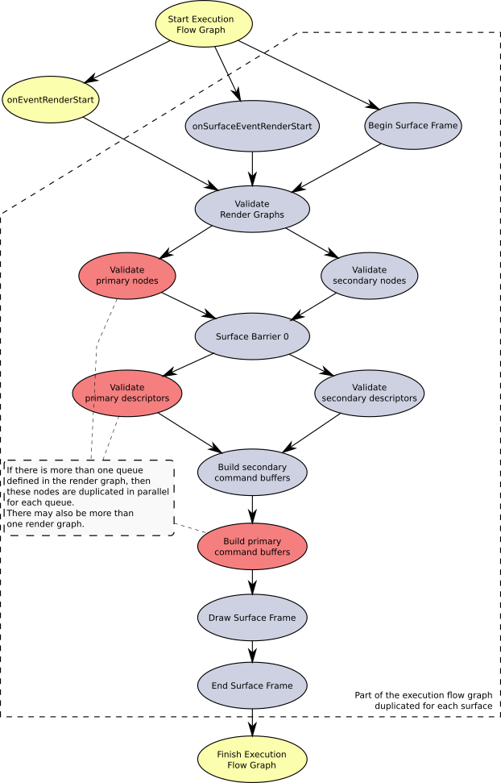

# Main render loop

In this article we introduce the architecture of main render loop. Main render loop has its own separate thread declared in **Viewer::run()** method. There are many things, that may be parallelized in render loop, so I decided to use [TBB flow graph](https://www.threadingbuildingblocks.org/) to implement it. The flow graph is executed using following lines of code :

```
opRenderGraphStart.try_put(tbb::flow::continue_msg());
renderGraph.wait_for_all();
```

The graph itself is constructed in **Viewer::buildRenderGraph()** method and it is dependent on how the **device layer** looks, especially: how many surfaces are there and how many VkQueues are used in each render workflow associated with each surface ( remark: at the moment there may be only one queue. Implementation of multiple queues will be made later - see Future Plans in README.md ).

Schema of tasks run during single frame rendering is presented below :



Tasks drawn in yellow color are executed once for each frame.

Tasks drawn in light blue color are duplicated for each surface declared in device layer.

## Node and descriptor validation

There are few methods in which user is able to modify data for rendering. User may:

- modify render workflow by
  - adding new render operations
  - rewiring operation inputs and outputs

- modify scenegraph by
  - adding new nodes
  - removing nodes
  - modyfying existing node attributtes ( e.g. changing graphics pipeline parameters )
- modify descriptor sets by
  - changing buffers and images connected to descriptors
- modify content of buffers and images


All these modifications should be made in events:

- **pumex::Viewer::onEventRenderStart()** - when modified data must be visible globally on each surface
- **pumex::Surface::onEventSurfaceRenderStart()** - when modified data is specific for a surface ( e.g. camera position )


Modifications made by user may have two possible consequences :

- data set in above mentioned events must be sent to GPU, but command buffers are still valid. For example :
  - buffer contents are invalid
  - image contents are invalid
- changes made by user invalidate command buffer. The whole command buffer must be rebuilt. Typical changes that have such consequence include :
  - modifications of nodes
  - modifications of descriptors
  - buffer or image resize ( buffer or image must be recreated. New buffer or image is not declared in existing command buffer )

Sending new data to GPU is called **validation**.


## Description of tasks in render loop

- **Start Render Graph** - empty task that serves as synchronization point
- **onEventRenderStart** - performs **pumex::Viewer::onEventRenderStart()** event
- **onSurfaceEventRenderStart** - performs **pumex::Surface::onEventSurfaceRenderStart()** event. This task is duplicated and run in parallel for each surface ( see diagram above )
- **Begin Surface Frame** - performs swapchain recreation when required ( e.g. when window size changed ) and then acquires swapchain image for rendering
- **Validate Render Workflow** - compiles render workflow if it's invalid. Rebuilds frame buffers. Creates / recreates pipeline barriers and presentation command buffers.
- **Validate primary nodes** - applies node visitor that validates scene graph nodes in all render operations. Processed scene graph nodes are not elements of subgraphs belonging to secondary command buffers. This task is duplicated and parallelized, when there are more than one queue in a render workflow.
- **Validate secondary nodes** - applies the same visitor validating nodes that belong secondary command buffers. Each subtree is processed in parallel.
- **Surface Barrier 0** - empty task that serves as synchronization point between validating nodes and validating descriptors.
- **Validate primary descriptors** - applies visitor that validates descriptors belonging to primary command buffers. Works analogically to node validation
- **Validate secondary descriptors** - applies visitor that validates descriptors belonging to secondary command buffers. Works analogically to node validation
- **Build secondary command buffers** - applies visitor that builds / rebuilds secondary command buffers when required. Secondary command buffers are built before primary command buffers, because secondary command buffers must be in executable state, when *vkCmdExecuteCommands* is recorded in primary command buffers.
- **Build primary command buffers** - applies visitor that builds / rebuilds primary command buffers when required
- **Draw Surface Frame** - submits all primary command buffers to appropriate queues
- **End Surface Frame** - waits for all queues to finish primary command buffer submission, then sends swapchain image to presentation engine using *vkQueuePresentKHR* function. Finally it performs **pumex::Surface::onEventSurfaceRenderFinish()** event.
- **Finish Render Graph** - runs after all surfaces sent their swapchain images to presentation engine. performs **pumex::Viewer::onEventRenderFinish()** event
