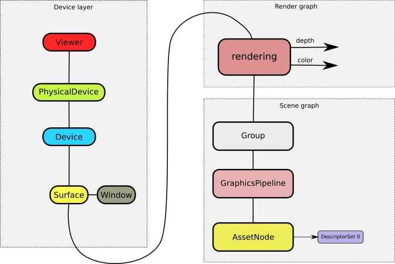

# Tutorial : rendering simple 3D object

In this document we will walk through creation of simple application similar to *pumexviewer* example.

The goal of our tutorial application is to load a 3D model provided in a command line and render it without textures. Application creates only one logical device, one surface and one window for rendering.

Resulting application structure is presented on the diagram below :





## main() function

We start by parsing the command line. This piece of code will be skipped for clarity, and only description of the parameters available in command line will be presented :

```
  -h, --help                        display this help menu
  -d                                enable Vulkan debugging
  -f                                create fullscreen window
  -p [presentation_mode]            presentation mode
  -u [update_frequency]             number of update calls per second
  -m [model]                        3D model filename
```
Parameters will be provided in a following variables :

- -d -  enableDebugging ( *bool* )
- -f -  useFullScreen ( *bool* )
- -p - presentMode ( *VkPresentModeKHR* )
- -u - updateFrequency ( *uint32_t* )
- -m - modelFileName ( *std::string* )

First object that we must create is **pumex::Viewer** responsible for creation of Vulkan *VkInstance* and for collecting information about physical devices ( GPUs ). All data required to create **pumex::Viewer** is provided in **pumex::ViewerTraits** structure. Our example does not need to use any Vulkan instance extensions, so we leave that variable empty. **pumex::ViewerTraits** structure also defines update frequency ( how many times per second will be update called ) - we have that value from command line parameters:

```C++
std::vector<std::string> instanceExtensions;
std::vector<std::string> requestDebugLayers;
if (enableDebugging)
  requestDebugLayers.push_back("VK_LAYER_LUNARG_standard_validation");

pumex::ViewerTraits viewerTraits{ "pumex viewer", instanceExtensions, requestDebugLayers, updateFrequency };

viewerTraits.debugReportFlags = VK_DEBUG_REPORT_ERROR_BIT_EXT;

viewer = std::make_shared<pumex::Viewer>(viewerTraits);
```

**pumex::Viewer** object created a *VkInstance* and collected information about available physical devices in its constructor.

Now we must create a logical device ( **pumex::Device** corresponding to *VkDevice* ). We will use physical device with index 0 to create our logical device ( well, I hope we have at least one GPU able to use Vulkan API :) ). Our device must be able to use swapchain images, so appropriate device extension must be declared :

```C++
std::vector<std::string> requestDeviceExtensions = { VK_KHR_SWAPCHAIN_EXTENSION_NAME };
auto device = viewer->addDevice(0, requestDeviceExtensions);
```

Our next goal after device creation is creation of a window. Creation of windows and surfaces is done separately in Pumex, so that in a future we will be able to connect Pumex created surface to external window provided by the user ( e.g. QT window ) :

```C++
std::string windowName = "Pumex viewer : ";
windowName += modelFileName;
pumex::WindowTraits windowTraits{ 0, 100, 100, 640, 480, useFullScreen ?pumex::WindowTraits::FULLSCREEN : pumex::WindowTraits::WINDOW, windowName };

std::shared_ptr<pumex::Window> window = pumex::Window::createWindow(windowTraits);
```

We can see that our window will be created on screen number 0, with specified position, size and name. If user requested fullscreen window in command line then the window will be fullscreen ( without OS specific window decorations ).

Next step is a surface creation ( **pumex::Surface** corresponding to *VkSurface* ). To create a surface - **pumex::SurfaceTraits** structure must be provided. **pumex::SurfaceTraits** must define following elements :

- imageCount - quantity of images that swapchain must provide
- color space of these images
- number of layers in these images ( usually 1 )
- swapchainPresentMode - a method of presenting image by swapchain ( fifo, mailbox, etc. ). We collected that value from command line parameters
- image transformation
- how the alpha will be treated

Our new **pumex::Surface** will be using earlier created device to do its work. And it will be shown on earlier created  window :

```C++
pumex::SurfaceTraits surfaceTraits{ 3, VK_COLOR_SPACE_SRGB_NONLINEAR_KHR, 1, presentMode, VK_SURFACE_TRANSFORM_IDENTITY_BIT_KHR, VK_COMPOSITE_ALPHA_OPAQUE_BIT_KHR };

std::shared_ptr<pumex::Surface> surface = viewer->addSurface(window, device, surfaceTraits);
```

Device layer is done at this point. Now we start to prepare a render workflow. During its work render workflow is responsible for allocation of memory used by framebuffers. There exists a special class to make these allocations possible : **pumex::DeviceMemoryAllocator**. It will allocate memory for render workflow images from a 16 MB pool of local GPU memory.

Render workflow must have a VkQueue to work on. Currently using only one queue is implemented, but when it will be ready - we will be able to use more queues in parallel. The queue is defined by **pumex::QueueTraits** structure :

```C++
auto frameBufferAllocator = std::make_shared<pumex::DeviceMemoryAllocator>(VK_MEMORY_PROPERTY_DEVICE_LOCAL_BIT, 16 * 1024 * 1024, pumex::DeviceMemoryAllocator::FIRST_FIT);

std::vector<pumex::QueueTraits> queueTraits{ { VK_QUEUE_GRAPHICS_BIT, 0, 0.75f } };

std::shared_ptr<pumex::RenderWorkflow> workflow = std::make_shared<pumex::RenderWorkflow>("viewer_workflow", frameBufferAllocator, queueTraits);
```

Inputs and outputs of workflow operations must have its types defined before we may use it. In our example there will be only one operation ( named *"rendering"* ), that has two outputs : depth buffer and a swapchain image. Both of them will have the same size corresponding to surface size. We declare all that data as shown below :

```C++
workflow->addResourceType("depth_samples", false, VK_FORMAT_D32_SFLOAT,    VK_SAMPLE_COUNT_1_BIT, pumex::atDepth,   pumex::AttachmentSize{ pumex::AttachmentSize::SurfaceDependent, glm::vec2(1.0f,1.0f) }, VK_IMAGE_USAGE_DEPTH_STENCIL_ATTACHMENT_BIT);

workflow->addResourceType("surface",       true, VK_FORMAT_B8G8R8A8_UNORM, VK_SAMPLE_COUNT_1_BIT, pumex::atSurface, pumex::AttachmentSize{ pumex::AttachmentSize::SurfaceDependent, glm::vec2(1.0f,1.0f) }, VK_IMAGE_USAGE_COLOR_ATTACHMENT_BIT);
```

Our render operation is a graphics operation that uses outputs with above defined types. For each output we must also define :

- image layout in which the image will be during operation
- what should be done to output image before operation starts ( load data, clear data to specified value, don't care about incoming data ). In our case we will clear the depth buffer to 1.0f and a swapchain image will be cleared with gray color ( [0.3, 0.3, 0.3, 1.0 ]).

```C++
workflow->addRenderOperation("rendering", pumex::RenderOperation::Graphics);

workflow->addAttachmentDepthOutput( "rendering", "depth_samples", "depth", VK_IMAGE_LAYOUT_DEPTH_STENCIL_ATTACHMENT_OPTIMAL, pumex::loadOpClear(glm::vec2(1.0f, 0.0f)));

workflow->addAttachmentOutput( "rendering", "surface", "color", VK_IMAGE_LAYOUT_COLOR_ATTACHMENT_OPTIMAL, pumex::loadOpClear(glm::vec4(0.3f, 0.3f, 0.3f, 1.0f)));
```

Render workflow is ready. Let's connect it to a surface.

```C++
auto workflowCompiler = std::make_shared<pumex::SingleQueueWorkflowCompiler>();

surface->setRenderWorkflow(workflow, workflowCompiler);
```

Workflow compiler is an object that processes abstract render workflow into appropriate Vulkan objects.

We must now build a scene graph that will be connected to the one and only render operation that we declared. To do this - we create a **pumex::Group** node that will serve as a root node of our scene graph:

```C++
auto renderRoot = std::make_shared<pumex::Group>();
workflow->setRenderOperationNode("rendering", renderRoot);
```

Scene graph must deliver three things required to render anything :

- graphics pipeline
- node that stores vertex and index data
- node that invokes one of the *vkCmdDraw* commands

Optionally it must also deliver descriptor sets if our shaders expect some input parameters ( and they usually do ).

In our case we will provide camera parameters and model position in two distinct uniform buffers. To create such descriptor set - we must first declare its layout :

```C++
std::vector<pumex::DescriptorSetLayoutBinding> layoutBindings =
{
  { 0, 1, VK_DESCRIPTOR_TYPE_UNIFORM_BUFFER, VK_SHADER_STAGE_VERTEX_BIT },
  { 1, 1, VK_DESCRIPTOR_TYPE_UNIFORM_BUFFER, VK_SHADER_STAGE_VERTEX_BIT }
};
auto descriptorSetLayout = std::make_shared<pumex::DescriptorSetLayout>(layoutBindings);
```

Shaders used by our **pumex::GraphicsPipeline** will be using above defined descriptor set layout. It means that we have to declare it in a pipeline layout. Moreover - graphics pipeline also needs a **pumex::PipelineCache** object :

```C++
auto pipelineLayout = std::make_shared<pumex::PipelineLayout>();
pipelineLayout->descriptorSetLayouts.push_back(descriptorSetLayout);

auto pipelineCache = std::make_shared<pumex::PipelineCache>();

auto pipeline = std::make_shared<pumex::GraphicsPipeline>(pipelineCache, pipelineLayout);
```

Every **pumex::GraphicsPipeline** must declare at least three things :

- all used shader stages : vertex shader, geometry shader, fragment shader and so on.
- definition of a vertex input : how does vertex layout looks like ( position, normals, texture coordinates and so on ). Such definition is called **vertex semantic** in Pumex library.
- blending state for each output color attachment. In our case we have only one output color attachment and it does not use blending

```C++
std::vector<pumex::VertexSemantic> requiredSemantic = { { pumex::VertexSemantic::Position, 3 },{ pumex::VertexSemantic::Normal, 3 },{ pumex::VertexSemantic::TexCoord, 2 },{ pumex::VertexSemantic::BoneWeight, 4 },{ pumex::VertexSemantic::BoneIndex, 4 } };

pipeline->shaderStages =
{
  { VK_SHADER_STAGE_VERTEX_BIT, std::make_shared<pumex::ShaderModule>(viewer, "shaders/viewer_basic.vert.spv"), "main" },
  { VK_SHADER_STAGE_FRAGMENT_BIT, std::make_shared<pumex::ShaderModule>(viewer, "shaders/viewer_basic.frag.spv"), "main" }
};

pipeline->vertexInput =
{
  { 0, VK_VERTEX_INPUT_RATE_VERTEX, requiredSemantic }
};

pipeline->blendAttachments =
{
  { VK_FALSE, 0xF }
};
```

Our graphics pipeline is ready, so we will add it to our scene graph :

```C++
renderRoot->addChild(pipeline);
```

**pumex::Asset** class represents a 3D model loaded from file and consists of :

- geometries ( meshes ) storing vertex and index data. Each mesh may have different vertex semantic
- skeleton used to animate an asset
- animations
- materials - sets of properties defining mesh outlook

To retrieve a **pumex::Asset** from a file we must use **pumex::AssetLoader** descendant. Currently only one loader is available in Pumex library - an Assimp loader ( **pumex::AssetLoaderAssimp** ). We will force this loader to load an asset from file so that the meshes have vertex semantic identical to one declared in graphics pipeline :

```C++
pumex::AssetLoaderAssimp loader;
std::shared_ptr<pumex::Asset> asset(loader.load(viewer, modelFileName, false, requiredSemantic));
```

**pumex::AssetNode** is a class that not only stores vertex and index data of an Asset instance, but also is able to invoke *vkCmdDrawIndexed* function during command buffer building. We will create it and add it to scene graph.

During its work **pumex::AssetNode** must create vertex and index buffers on a GPU, so it needs **pumex::DeviceMemoryAllocator** . This allocator will have 64 MB of local GPU memory at its disposal.

```C++
auto verticesAllocator = std::make_shared<pumex::DeviceMemoryAllocator>(VK_MEMORY_PROPERTY_DEVICE_LOCAL_BIT, 64 * 1024 * 1024, pumex::DeviceMemoryAllocator::FIRST_FIT);

auto assetNode = std::make_shared<pumex::AssetNode>(asset, verticesAllocator, 1, 0);

pipeline->addChild(assetNode);
```

The last part of a scene graph is a descriptor set. Its layout is defined already, but buffers connected to it are not. These buffers contain some dynamic data, like object position and camera parameters ( view matrix, projection matrix, etc. ).

We will move these buffers to external class that will be responsible for dynamic aspects of our application ( e.g. camera movement, animation of a model ). Let's call that class **TutorialApplicationData**. Definition of this class will be described later, for now we will just create it and use it. Buffers are created inside that class and they need to use GPU memory, so we will add another pumex::DeviceMemoryAllocator to cover these needs - 1 MB of host visible memory will be more than enough. This memory is host visible, because we will be updating these buffers every frame:

```C++
auto buffersAllocator = std::make_shared<pumex::DeviceMemoryAllocator>(VK_MEMORY_PROPERTY_HOST_VISIBLE_BIT, 1 * 1024 * 1024, pumex::DeviceMemoryAllocator::FIRST_FIT);

auto applicationData = std::make_shared<TutorialApplicationData>(buffersAllocator);
```

Camera movement will be handled by mouse and keyboard input events during update stage by dedicated input handler named **pumex::BasicCameraHandler**. We must create that input handler, connect it to a **pumex::Viewer** ( to capture input events ) and to the **TutorialApplicationData** ( to calculate current camera view matrix in render stage ) :

```C++
auto bcamHandler = std::make_shared<pumex::BasicCameraHandler>();
viewer->addInputEventHandler(bcamHandler);
applicationData->setCameraHandler(bcamHandler);
```

**TutorialApplicationData** stores both memory buffers. To create a descriptor set we must inform it how these buffers will be used ( as uniform buffers ) :

```C++
auto cameraUbo   = std::make_shared<pumex::UniformBuffer>(applicationData->cameraBuffer);
auto positionUbo = std::make_shared<pumex::UniformBuffer>(applicationData->positionBuffer);
```

Now we create a descriptor set with a specified layout and connect it to assetNode.

Similarly to buffers and memory allocators the descriptor set must have a descriptor pool from which it allocates its internal memory:

```C++
auto descriptorPool = std::make_shared<pumex::DescriptorPool>();

auto descriptorSet = std::make_shared<pumex::DescriptorSet>(descriptorPool, descriptorSetLayout);

descriptorSet->setDescriptor(0, cameraUbo);
descriptorSet->setDescriptor(1, positionUbo);

assetNode->setDescriptorSet(0, descriptorSet);
```

Application structure as defined on a diagram placed at the begining of the tutorial is ready to work. There are only few important things left.

We will start from viewer and surface render events. Pumex library defines following set of render events ( not to be mistaken with input events - these happen in update stage, not render stage ) :

- **pumex::Viewer::onEventRenderStart()** - before the rendering on any surface begins
- **pumex::Surface::onEventSurfacePrepareStatistics()** - not covered here, required to collect time statistics
- **pumex::Surface::onEventSurfaceRenderStart()** - before particular surface rendering begins
- **pumex::Surface::onEventSurfaceRenderFinish()** - when particular surface rendering finishes
- **pumex::Viewer::onEventRenderFinish()** - when all surfaces finish its rendering

In our example we will use **pumex::Viewer::onEventRenderStart()** event to calculate current position and animation state of rendered object - this object's state must be the same on each surface.

Camera position is specific for every surface, so to calculate it - we will use event named  **pumex::Surface::onEventSurfaceRenderStart()** triggered for each surface independently ( we only have one surface in our example ) :

```C++
viewer->setEventRenderStart( std::bind( &TutorialApplicationData::prepareModelForRendering, applicationData, std::placeholders::_1, asset) );

surface->setEventSurfaceRenderStart( std::bind(&TutorialApplicationData::prepareCameraForRendering, applicationData, std::placeholders::_1) );
```

Methods *prepareModelForRendering()* and *prepareCameraForRendering()* will be defined later in **TutorialApplicationData** class.

After setting up events in render stage, we have to implement the update stage.

Both render stage and update stage use Intel TBB flow graph internally to do their job. Flow graph consist of tasks that may be run in parallel.

Render flow graph is built automatically in **pumex::Viewer** class based on current device layer outlook.

But update flow graph must be built manually by user, because application doesn't know anything about user's intentions and cannot assume anything.

In our example the whole update flow graph will include only one task: a call to *TutorialApplicationData::update()* method :

```C++
tbb::flow::continue_node< tbb::flow::continue_msg > update(viewer->updateGraph, [=](tbb::flow::continue_msg) { applicationData->update(viewer); });

tbb::flow::make_edge(viewer->opStartUpdateGraph, update);
tbb::flow::make_edge(update, viewer->opEndUpdateGraph);
```

The whole application is ready - we need to start it :

```C++
viewer->run();
viewer->cleanup();
return 0;
```

*Viewer::run()* method collects information about all *VkQueue* objects required by all render workflows, then uses this information to realize **pumex::Device**s ( that's the moment when these devices are created ) and **pumex::Surface**s ( they're created at this moment as well ). After *VkDevice* and *VkSurface* creation - run() method starts separate render thread and performs updates in main thread. Both render thread and update thread perform its work until user requests exit from application.

At that moment Viewer::cleanup() method is called to remove all objects created in our tutorial ( surfaces, devices, windows, Vulkan instance, render workflows, scene graphs, etc. ).


## Example class TutorialApplicationData

This class is responsible for storing, updating and sending data to rendering.

In our example we have only two data objects that need to be updated:

- model position and animation state represented by PositionData structure.
- camera parameters ( viewMatrix, projectionMartix, observer position ) represented bu **pumex::Camera** class

PositionData is a collection of 4x4 matrices defining current pose of an object and animation state of every bone in a skeleton:

```C++
const uint32_t MAX_BONES = 511;

struct PositionData
{
  PositionData()
  {
  }
  PositionData(const glm::mat4& p)
    : position{ p }
  {
  }
  glm::mat4 position;
  glm::mat4 bones[MAX_BONES];
};

```

**pumex::Camera** class is used so often that it was promoted to Pumex library.

Both of these structures must have its shader counterpart ( SPIR-V ) , so both must obey std140 or std430 alignment rules ( which are much more strict than C++ rules ) depending if they are used in uniform buffers ( std140 ), or storage buffers ( std430 ). The simplest way to have these requirements met is to use glm::vec4 and glm::mat4 variables only :).

If above mentioned requirements are met - we are able to freely send this data between CPU and GPU. Let's see the declaration of variables used in **TutorialApplicationData** class:

```C++
struct TutorialApplicationData
{
  std::shared_ptr<pumex::Buffer<pumex::Camera>> cameraBuffer;
  std::shared_ptr<PositionData>                 positionData;
  std::shared_ptr<pumex::Buffer<PositionData>>  positionBuffer;
  std::shared_ptr<pumex::BasicCameraHandler>    camHandler;
```

Each memory buffer is an instance of templated **pumex::Buffer** class. If you want to send single object to GPU memory ( for example : pumex::Camera ), then just declare such buffer as :

```C++
std::shared_ptr<pumex::Buffer<pumex::Camera>> oneCameraBuffer;
```

You are also able to send many objects at once using std::vector of such objects ( it's very handy, especially when you are using storage buffers ) :

```C++
std::shared_ptr<pumex::Buffer<std::vector<PositionData>>> manyObjectsBuffer;
```

Let's go back to our TutorialApplicationData class. Here we have constructor that creates class instance and a method for setting up the camera handler. Buffers are created with provided **pumex::DeviceMemoryAllocator** .

```C++
TutorialApplicationData( std::shared_ptr<pumex::DeviceMemoryAllocator> buffersAllocator )
{
  cameraBuffer     = std::make_shared<pumex::Buffer<pumex::Camera>>(buffersAllocator, VK_BUFFER_USAGE_UNIFORM_BUFFER_BIT, pumex::pbPerSurface, pumex::swOnce, true);

  positionData     = std::make_shared<PositionData>();
  positionBuffer   = std::make_shared<pumex::Buffer<PositionData>>(positionData, buffersAllocator, VK_BUFFER_USAGE_UNIFORM_BUFFER_BIT, pumex::pbPerDevice, pumex::swOnce);
}

void setCameraHandler(std::shared_ptr<pumex::BasicCameraHandler> bcamHandler)
{
  camHandler = bcamHandler;
}

```

There is one **VERY IMPORTANT** thing that has critical meaning, which we must discuss here :

*cameraBuffer* is created with **pumex::pbPerSurface** flag which means that it has a GPU copy of that buffer on each surface and may have different content on each surface.

In contrast *positionBuffer* is created with **pumex::pbPerDevice** flag which means that buffer's GPU copies exist on every logical device. If we have two surfaces using the same device then you have only one GPU copy of that buffer and both surfaces use the same buffer.

The next flag **pumex::swOnce** means that on each device/surface there is only one copy of the buffer. To explain what does it mean we must explain how command buffers work in Pumex library:

During command buffer building surface uses as many primary command buffers as there is swapchain images.

If you use three swapchain images - surface creates three primary command buffers : one for each swapchain image. When you acquire a swapchain image - it means that corresponding command buffer is not in use and may be rebuilt if required - or it may just be submited to queue instantly when there's no need to rebuild.

Question is : in what situation there is a need to rebuild a primary command buffer?

For memory buffers the answer is simple: when buffer was removed and created again. When does that happen ? When you want to change the size of the buffer. You may do it only by destroying old buffer and creating a new one with bigger size.

If you have buffer created with **pumex::swOnce** flag - it means that all three primary command buffers use the same buffer and at least one of them is currently executed on GPU ( command buffer is in pending state ). You cannot remove a memory buffer which is used by command buffer in pending state.

Conclusion : **WHEN YOU KNOW THAT YOUR BUFFER WILL NOT CHANGE SIZE DURING ITS LIFETIME - USE pumex::swOnce FLAG DURING CREATION. **
**OTHERWISE ALWAYS USE pumex::swForEachImage FLAG** .

When you use **pumex::swForEachImage** flag - there will be as many copies of the buffer as there is swapchain images ( times copies resulting from **pumex::pbPerDevice** / **pumex::pbPerSurface** ). And you are able to freely manipulate the size of the underlying buffer.

*cameraBuffer* and *positionBuffer* only store one object each and will not change size during application work, so it's OK to use **pumex::swOnce** flag in this case.

As we mentioned before - camera setup happens in *prepareCameraForRendering()* method:

```C++
void prepareCameraForRendering(std::shared_ptr<pumex::Surface> surface)
{
  auto viewer           = surface->viewer.lock();
  float deltaTime       = pumex::inSeconds(viewer->getRenderTimeDelta());
  float renderTime      = pumex::inSeconds(viewer->getUpdateTime() - viewer->getApplicationStartTime()) + deltaTime;
  uint32_t renderWidth  = surface->swapChainSize.width;
  uint32_t renderHeight = surface->swapChainSize.height;
  glm::mat4 viewMatrix  = camHandler->getViewMatrix(surface.get());

  pumex::Camera camera;
  camera.setViewMatrix(viewMatrix);
  camera.setObserverPosition(camHandler->getObserverPosition(surface.get()));
  camera.setTimeSinceStart(renderTime);
  camera.setProjectionMatrix(glm::perspective(glm::radians(60.0f), (float)renderWidth / (float)renderHeight, 0.1f, 100000.0f));
  cameraBuffer->setData(surface.get(), camera);
}
```

**pumex::Camera** object has its properties set. and then it's sent to GPU buffer copy for this specific surface using method **pumex::Buffer::setData(Surface*, data)** .

Below is the definition of *prepareModelForRendering()* method.

```C++
void prepareModelForRendering(pumex::Viewer* viewer, std::shared_ptr<pumex::Asset> asset)
{
  // animate asset if it has animation
  if (asset->animations.empty())
    return;

  float deltaTime          = pumex::inSeconds(viewer->getRenderTimeDelta());
  float renderTime         = pumex::inSeconds(viewer->getUpdateTime() - viewer->getApplicationStartTime()) + deltaTime;
  pumex::Animation& anim   = asset->animations[0];
  pumex::Skeleton& skel    = asset->skeleton;
  uint32_t numAnimChannels = anim.channels.size();
  uint32_t numSkelBones    = skel.bones.size();

  std::vector<uint32_t> boneChannelMapping(numSkelBones);
  for (uint32_t boneIndex = 0; boneIndex < numSkelBones; ++boneIndex)
  {
    auto it = anim.invChannelNames.find(skel.boneNames[boneIndex]);
    boneChannelMapping[boneIndex] = (it != end(anim.invChannelNames)) ? it->second : std::numeric_limits<uint32_t>::max();
  }

  std::vector<glm::mat4> localTransforms(MAX_BONES);
  std::vector<glm::mat4> globalTransforms(MAX_BONES);

  anim.calculateLocalTransforms(renderTime, localTransforms.data(), numAnimChannels);
  uint32_t bcVal = boneChannelMapping[0];
  glm::mat4 localCurrentTransform = (bcVal == std::numeric_limits<uint32_t>::max()) ? skel.bones[0].localTransformation : localTransforms[bcVal];
  globalTransforms[0] = skel.invGlobalTransform * localCurrentTransform;
  for (uint32_t boneIndex = 1; boneIndex < numSkelBones; ++boneIndex)
  {
    bcVal = boneChannelMapping[boneIndex];
    localCurrentTransform = (bcVal == std::numeric_limits<uint32_t>::max()) ? skel.bones[boneIndex].localTransformation : localTransforms[bcVal];
    globalTransforms[boneIndex] = globalTransforms[skel.bones[boneIndex].parentIndex] * localCurrentTransform;
  }
  for (uint32_t boneIndex = 0; boneIndex < numSkelBones; ++boneIndex)
    positionData->bones[boneIndex] = globalTransforms[boneIndex] * skel.bones[boneIndex].offsetMatrix;

  positionBuffer->invalidateData();
}
```

What's important to note is that *positionData* is stored outside the *positionBuffer*. When this data changes - you need to call **pumex::Buffer::invalidateData()**, to send it to GPU. Moreover using **pumex::Buffer::setData(data)** or **pumex::Buffer::invalidateData()** methods means that data is the same on each device/surface - in contrast to **pumex::Buffer::setData(Surface*, data)** and **pumex::Buffer::setData(Device*, data)**.

Last part of the **TutorialApplicationData** clas is the *update()* method, which is called in update stage as defined earlier :

```C++
void update(std::shared_ptr<pumex::Viewer> viewer)
{
  camHandler->update(viewer.get());
}
}; // end of TutorialApplicationData
```

At the beginning of update stage Viewer collects all input events ( mouse and keyboard ) from every window it manages. Then it sends these input events to input handlers. **pumex::BasicCameraHandler** gets these events and accumulates them. Then on each frame **pumex::BasicCameraHandler::update()** is called and if there were some new input events - new camera position is calculated.

**One important notice**: update stage calculates not only new position and orientation of a camera, but also its linear and angular velocity. Thanks to this during render stage we are able to extrapolate new camera position having temporal difference between update stage and render stage ( there exists special **pumex::Kinematic** structure that stores object position, rotation **and** velocites: linear and angular ).

## Vertex and fragment shader

At the end of a tutorial we will show vertex and fragment shaders rendering the model.

Firstly our vertex shader must declare version and used extensions :

```GLSL
#version 450
#extension GL_ARB_separate_shader_objects : enable
#extension GL_ARB_shading_language_420pack : enable
```

As we know - the vertex shader must use the same vertex semantic declared in **pumex::GraphicsPipeline**.

Let's look at the definition of vertex semantic once more :

```C++
std::vector<pumex::VertexSemantic> requiredSemantic = { { pumex::VertexSemantic::Position, 3 },{ pumex::VertexSemantic::Normal, 3 },{ pumex::VertexSemantic::TexCoord, 2 },{ pumex::VertexSemantic::BoneWeight, 4 },{ pumex::VertexSemantic::BoneIndex, 4 } };
```

Vertex shader must declare inputs corresponding to above shown vertex semantic :

```GLSL
layout (location = 0) in vec3 inPos;
layout (location = 1) in vec3 inNormal;
layout (location = 2) in vec2 inUV;
layout (location = 3) in vec4 inBoneWeight;
layout (location = 4) in vec4 inBoneIndex;
```

Graphics pipeline uses two uniform buffers ( camera state and model state ) that must be declared here as well :

```GLSL
layout (set = 0, binding = 0) uniform CameraUbo
{
  mat4 viewMatrix;
  mat4 viewMatrixInverse;
  mat4 projectionMatrix;
  vec4 observerPosition;
} camera;

#define MAX_BONES 511
layout (set = 0, binding = 1) uniform PositionUbo
{
  mat4  position;
  mat4  bones[MAX_BONES];
} object;
```

You may compare above defined GLSL structures with their C++ counterparts.

pumex::Camera class corresponding to CameraUbo uniform buffer looks like this :

```C++
class Camera
{
  // methods ommited for clarity
  glm::mat4 viewMatrix;
  glm::mat4 viewMatrixInverse;
  glm::mat4 projectionMatrix;
  glm::vec4 observerPosition; // used for LOD computations. Usually the same as in viewMatrix
  glm::vec4 params;           // params.x = timeSinceStart
};
```

And PositionData struct corresponding to PositionUbo uniform buffer is declared like this :

```C++
const uint32_t MAX_BONES = 511;

struct PositionData
{
  // methods ommited for clarity
  glm::mat4 position;
  glm::mat4 bones[MAX_BONES];
};
```

Vertex shader now declares additional constants :

```GLSL
const vec3 lightDirection = vec3(0,0,1);
```

...and now outputs of the vertex shader are declared :

```GLSL
layout (location = 0) out vec3 outNormal;
layout (location = 1) out vec3 outColor;
layout (location = 2) out vec2 outUV;
layout (location = 3) out vec3 outViewVec;
layout (location = 4) out vec3 outLightVec;
```

Vertex shader main() function implements skeletal animation with directional lighting always parallel to camera viewing axis :

```GLSL
void main()
{
  mat4 boneTransform = object.bones[int(inBoneIndex[0])] * inBoneWeight[0];
  boneTransform     += object.bones[int(inBoneIndex[1])] * inBoneWeight[1];
  boneTransform     += object.bones[int(inBoneIndex[2])] * inBoneWeight[2];
  boneTransform     += object.bones[int(inBoneIndex[3])] * inBoneWeight[3];
  mat4 modelMatrix  = object.position * boneTransform;

  outNormal        = mat3(inverse(transpose(modelMatrix))) * inNormal;
  outColor         = vec3(1.0,1.0,1.0);
  outUV            = inUV;
  vec4 eyePosition = camera.viewMatrix * modelMatrix * vec4(inPos.xyz, 1.0);
  outLightVec      = normalize ( mat3( camera.viewMatrixInverse ) * lightDirection );
  outViewVec       = -eyePosition.xyz;

  gl_Position      = camera.projectionMatrix * eyePosition;
}
```

Input variables of a fragment shader must correspond to output variables of vertex shader.

```GLSL
#version 450

#extension GL_ARB_separate_shader_objects : enable
#extension GL_ARB_shading_language_420pack : enable

layout (location = 0) in vec3 inNormal;
layout (location = 1) in vec3 inColor;
layout (location = 2) in vec2 inUV;
layout (location = 3) in vec3 inViewVec;
layout (location = 4) in vec3 inLightVec;
```

Output variable must be declared. It will be stored as a result in a swapchain image :

```GLSL
layout (location = 0) out vec4 outFragColor;
```

Fragment shader main() function implements simple Phong shading :

```GLSL
void main()
{
  vec4 color = vec4(inColor,1);

  vec3 N        = normalize(inNormal);
  vec3 L        = normalize(inLightVec);
  vec3 V        = normalize(inViewVec);
  vec3 R        = reflect(-L, N);
  vec3 ambient  = vec3(0.1,0.1,0.1);
  vec3 diffuse  = max(dot(N, L), 0.0) * vec3(0.9,0.9,0.9);
  vec3 specular = pow(max(dot(R, V), 0.0), 128.0) * vec3(1,1,1);
  outFragColor  = vec4(ambient + diffuse * color.rgb + specular, 1.0);
}
```


